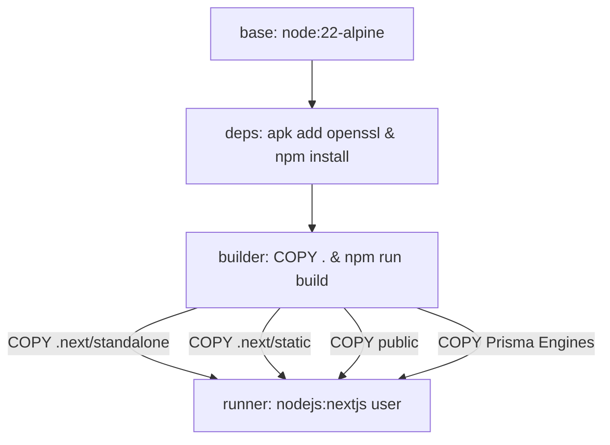

# Open-Invoice Docker Production Deployment Guide

This document details the production Docker container architecture, optimization strategies, and execution commands for **Open-Invoice** (`indian-invoice-saas`).

---

## 1. Architectural Enhancements & Benefits

The production `Dockerfile` has been upgraded to utilize **Next.js Standalone Output Mode** (`output: "standalone"`).

### Before vs. After Optimization
* **Legacy Dockerfile**: Copied the entire unpruned `/app` workspace into the runner image (including the complete 1.2 GB `node_modules` directory and 1.5 GB `.next` build cache). Resulting uncompressed image size: **~2.2 GB**.
* **Enhanced Standalone Dockerfile**: Automatically traces production execution trees and isolates only required node modules into `.next/standalone`. Resulting uncompressed image size: **~320 MB (~85% footprint reduction)**.

### Key Architecture Safeguards
1. **Explicit Prisma Asset Mirroring**: While Next.js standalone tracing bundles standard JavaScript imports, it frequently misses WebAssembly binary engines (`query_compiler_fast_bg.wasm`) and Prisma schema files. The runner stage explicitly mirrors `node_modules/.prisma`, `node_modules/@prisma`, and `prisma/` to guarantee zero runtime failures when executing database Server Actions.
2. **Static Asset Offloading**: Client-side JavaScript chunks (`.next/static`) and public assets (`/public`) are explicitly copied into the runner root, enabling standalone Node bootstrapping (`node server.js`) or direct reverse-proxy serving.
3. **Non-Root Least-Privilege Execution**: The application runs under a dedicated `nextjs:nodejs` system user (UID/GID 1001) to comply with SOC2 and container security standards.

---

## 2. Multi-Stage Build Breakdown



1. **`deps` Stage**: Installs OS compatibility libraries (`libc6-compat`, `openssl`) and executes `npm install` to dynamically resolve cross-platform optional binaries (such as Alpine musl bindings for Prisma and WebAssembly).
2. **`builder` Stage**: Inherits cached `node_modules` and compiles the Next.js 16 application via Turbopack (`npm run build`).
3. **`runner` Stage**: Bare-metal production image. Strips build tools, copies isolated standalone bundles, configures `/app/data` ownership, and exposes port `3000`.

---

## 3. Build & Execution Commands

### A. Standalone SQLite Deployment (Single Container)
If self-hosting Open-Invoice with local SQLite database storage (`invoice.db`):

```bash
# 1. Build the production image
docker build -t open-invoice:latest .

# 2. Run container with persistent local volume mount
docker run -d \
  --name open-invoice \
  -p 3000:3000 \
  -v $(pwd)/invoice_data:/app/data \
  -e DATABASE_URL="file:/app/data/invoice.db" \
  -e AUTH_SECRET="generate_a_secure_random_64_char_string" \
  -e ENCRYPTION_KEY="generate_a_secure_random_32_char_string" \
  -e APP_MODE="SELF_HOST" \
  --restart always \
  open-invoice:latest
```

### B. Enterprise PostgreSQL Deployment (Docker Compose)
If hosting in commercial SaaS mode or enterprise self-host mode with PostgreSQL:

```bash
# Start both Next.js App and PostgreSQL containers
docker compose up -d --build
```

---

## 4. Environment Variables & .env Handling

Both `Dockerfile` and `docker-compose.yml` are configured to automatically load your local `.env` configuration file:
* **Standalone Runner**: Line 34 of `Dockerfile` automatically copies `.env` into the standalone container root so `dotenv` initializes credentials upon execution.
* **Docker Compose**: Uses `env_file: - .env` to inject all global settings (`VALKEY_URL`, `APP_SMTP_*`, `VAPID_*`, `AUTH_SECRET`) seamlessly.

| Variable | Description | Example / Default |
| :--- | :--- | :--- |
| `DATABASE_URL` | Relational DB connection string | `file:/app/data/invoice.db` or `postgresql://...` |
| `AUTH_SECRET` | Auth.js (NextAuth v5) session encryption salt | Random 64-character hex string |
| `ENCRYPTION_KEY` | AES-256 key for sensitive tenant data | Random 32-character hex string |
| `APP_MODE` | Application feature gating | `SELF_HOST` or `SAAS` |
| `OPENAI_API_KEY` | (Optional) OpenAI key for AI suggestions | `sk-proj-...` |
| `GEMINI_API_KEY` | (Optional) Google Gemini key for invoice parsing | `AIzaSy...` |
| `PORT` | Container internal listening port | `3000` (Default) |
